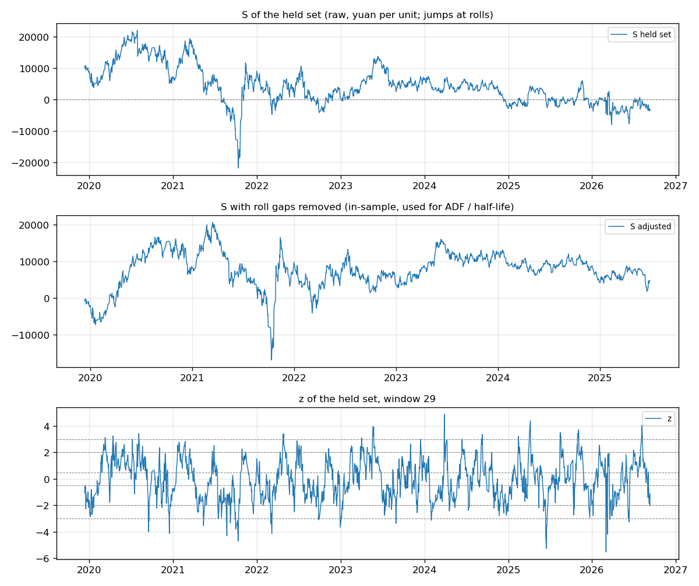
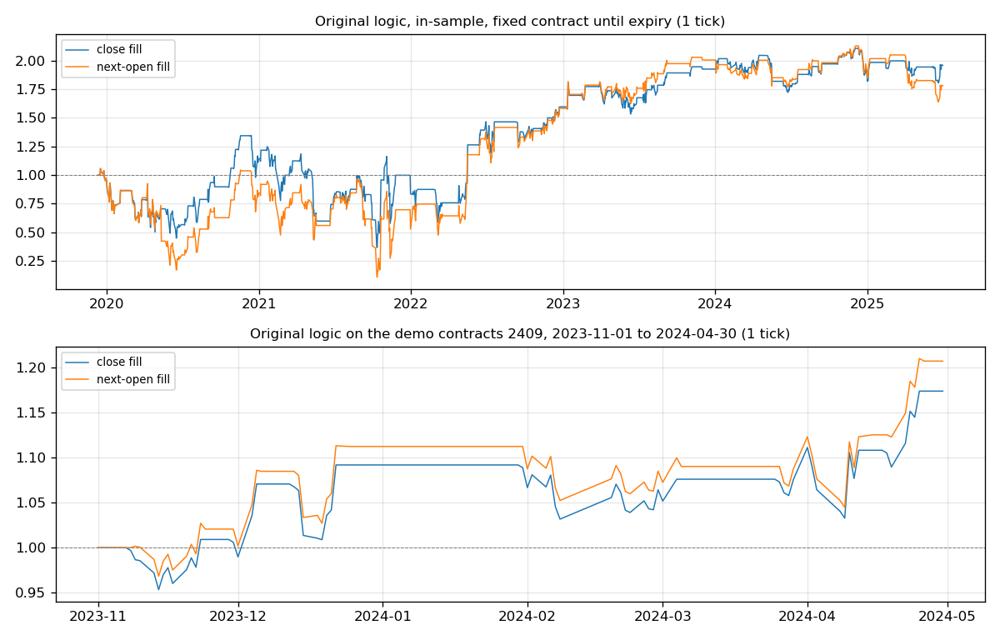
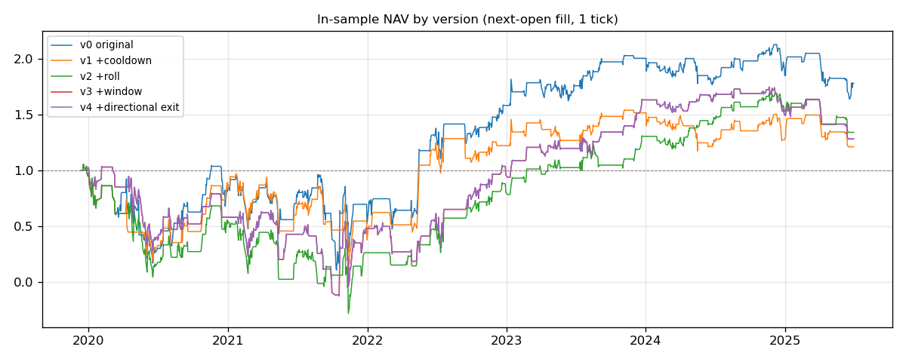
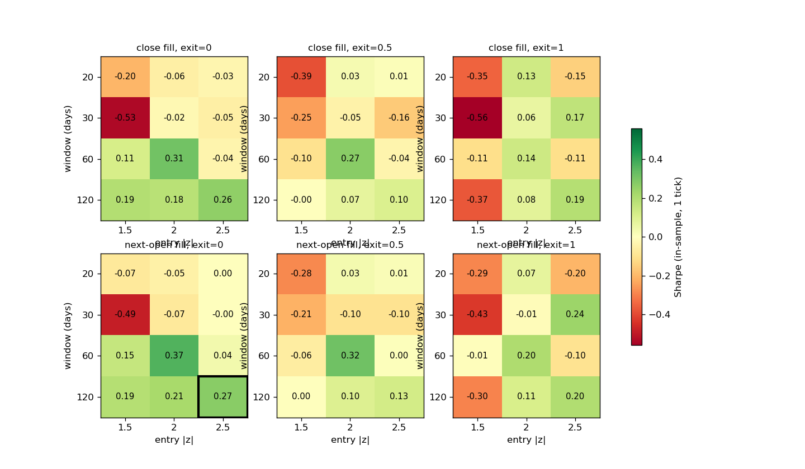
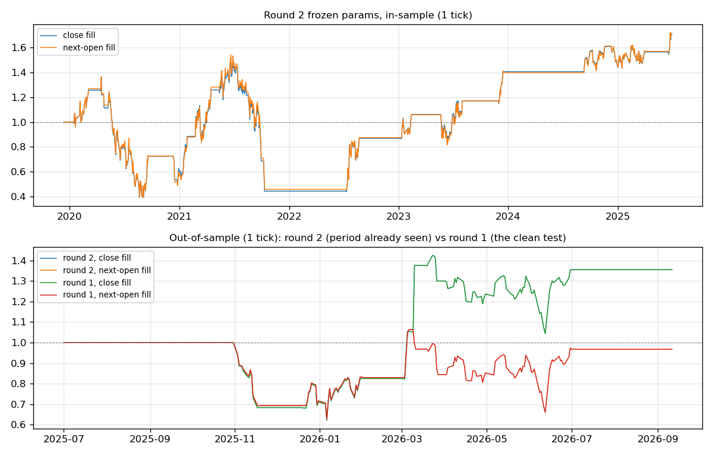
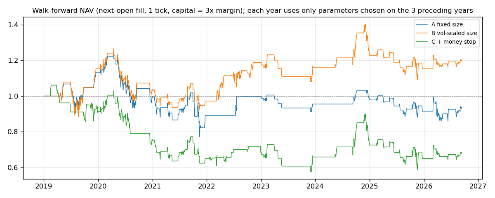

# MTO 价差策略复盘：复现、缺陷与修正

本报告由 `python run_all.py` 生成，文中数字全部由代码从 `data/` 下两个原始文件算出。项目做了三轮：第一轮是原始设计（样本内 2015-05-04 起，样本外 2025-07-01 至 2026-09-11，唯一一次干净的样本外检验）；第二轮是看过第一轮样本外之后按要求做的修订（样本内 2019-12-12 至 2025-06-30）；第三轮改用滚动检验，并加了资金与风控，见第 11 节。

## 1 两轮说明与第一轮结果

第一轮按任务书的顺序完成：只用样本内（2015-05-04 至 2025-06-30）选参，单独提交冻结参数 `report/round1/params.json`，再在样本外只跑一次。这是本项目唯一一次干净的样本外检验。第一轮冻结参数为窗口 120、开仓 2.5、平仓 0，结果（1 跳成本；保守＝次日开盘成交，乐观＝信号日收盘成交）：

| 结果 | 口径 | 年化收益 | 最大回撤 | 夏普 | 交易次数 |
|---|---|---|---|---|---|
| 原版（样本内） | 保守 | 5.0% | 112.0% | 0.07 | 158 |
| 原版（样本内） | 乐观 | -1.3% | 162.3% | -0.02 | 158 |
| 修正版 v4（样本内） | 保守 | 4.6% | 88.8% | 0.10 | 45 |
| 修正版 v4（样本内） | 乐观 | 3.5% | 98.8% | 0.07 | 45 |
| 冻结参数（样本内） | 保守 | 14.5% | 71.6% | 0.27 | 29 |
| 冻结参数（样本内） | 乐观 | 13.7% | 66.2% | 0.26 | 29 |
| 冻结参数（样本外） | 保守 | -2.8% | 38.0% | -0.07 | 7 |
| 冻结参数（样本外） | 乐观 | 30.3% | 37.8% | 0.59 | 7 |

`run_all.py` 每次都重算第一轮，并核对冻结参数与样本外结果文件和首次运行时入库的版本逐字节一致。

看过第一轮样本外之后，按要求改了三处，形成第二轮：

| 项目 | 第一轮 | 第二轮 | 原因 |
|---|---|---|---|
| 样本内起点 | 2015-05-04（按流动性定） | 2019-12-12 | 三腿交易时段从这个交易日起完全一致，见第 3 节时间线 |
| 换月候选 | 全部交割月 | 只在 01、05、09 月 | 第一轮样本内有 5 次先换到非 01/05/09 月份，2–10 个交易日内又换一次，有持仓时多付一次换月成本 |
| ③ 窗口 | 不超过半衰期的最大网格窗口，120 天 | 半衰期取整；在持组自有历史不够时取样本内每天都算得出 z 的最长窗口，34 天 | 第一轮这条规则是看过样本内网格之后改的 |

成本、成交口径、网格、选参规则、止损倍数、冷静期、方向性平仓都没变。第二轮的设计在跑之前写进 PROGRESS.md，冻结参数 `report/round2/params.json` 在样本内选定后单独提交，之后才首次运行第二轮样本外。但这三处修改是在看过第一轮样本外之后做的，2025-07-01 以后的数据对第二轮已经不是独立检验，第二轮样本外只作参考；要检验第二轮，需要 2026-09-11 以后的新数据。

第二轮按同一选参规则在新样本内选出的参数与第一轮相同（窗口 120、开仓 2.5、平仓 0）。样本外期间两轮的换月日历有 21 个交易日不同（2026-07-30 至 2026-08-27，第一轮在持 202610 组，第二轮在持 202701 组），这些天两轮都空仓。所以第二轮样本外交易与第一轮逐笔相同，第二轮的修改没有改变样本外结果。

以下第 2–10 节为第二轮，第 11 节为第三轮。

## 2 策略概述

来源为天勤量化 tqsdk-python 的示例脚本 `tqsdk/demo/example/mto_spread.py`。甲醇制烯烃（MTO）装置大约 3 吨甲醇产 1 吨烯烃，脚本用 1 手聚乙烯 L（5 吨）加 1 手聚丙烯 PP（5 吨）对 3 手甲醇 MA（每手 10 吨）构造利润价差：

S = 5·L + 5·PP − 30·MA（元/单位）

原脚本逻辑：取当日之前 29 个交易日的 S，算均值 μ 和标准差 σ（np.std，总体口径），z = (S − μ)/σ。空仓时 z > 2 做空利润（卖 L、卖 PP、买 MA），z < −2 做多利润；持仓时 |z| < 0.5 平仓，持空且 z > 3、持多且 z < −3 止损。合约写死为 2409，回测区间写死为 2023-11-01 至 2024-04-30。

步骤：用日线逐条复现原逻辑，给缺陷定量，逐项修正（每步只改一处），只用样本内做参数网格和稳健性检验并冻结参数，最后在样本外运行。

## 3 数据与方法

**数据**：tushare `fut_basic`（合约表）与 `fut_daily`（逐合约日线），由 `src/fetch_data.py` 一次性下载，之后只读。文件 sha256：

- `daily_MA_L_PP.csv`：`5ed7d15fc3d3562c1eb798efeac4621b90838935bd12f2155347c6647eaf8341`
- `contracts_MA_L_PP.csv`：`ac2452795c1953f682f8103963a99c3a15d9d296ddcb6290b1f31a4c80b0b8df`

| 项目 | L | PP | MA |
|---|---|---|---|
| 交易所 | DCE | DCE | CZCE |
| 合约表合约数 | 239 | 160 | 147 |
| 日线合约数 | 164 | 160 | 147 |
| 日线行数 | 38516 | 36581 | 34390 |
| 首日 | 20130118 | 20140228 | 20140617 |
| 末日 | 20260911 | 20260911 | 20260911 |
| 每手吨数(per_unit) | 5 | 5 | 10 |
| multiplier非空数 | 0 | 0 | 0 |
| 最小变动价位 | 1人民币元/吨 | 1人民币元/吨 | 1人民币元/吨 |
| 代码示例(ts_code/symbol) | L2708.DCE / L2708 | PP2708.DCE / PP2708 | MA2708.ZCE / MA708 |
| 收盘缺失 | 34 | 31 | 7010 |
| 开盘缺失 | 14028 | 12431 | 7120 |
| 持仓量缺失 | 0 | 0 | 0 |
| 成交量为0行数 | 13956 | 12356 | 7087 |

每手吨数取合约表 `per_unit` 列（MA 10、L 5、PP 5）；tushare 的 `multiplier` 列对商品期货为空。郑商所 ts_code 用 4 位年月（如 MA2409.ZCE），symbol 用 3 位（MA409）。

**最小变动价位**：合约表对三个品种都写 1 元/吨。有成交的行里开高低收全是 5 的整数倍的比例，L 在 2021-11-01 之前为 99.8%、之后为 3.7%，PP、MA 在该日之前分别为 7.9%、4.5%；大商所公告（见下表）证实聚乙烯自 2021-11-01 起由 5 元/吨改为 1 元/吨。L 在此之前按 5 元/吨一跳计滑点，之后按 1 元/吨；PP、MA 始终 1 元/吨。

**无成交日**：日线中收盘价缺失 7,075 行，用当日结算价补；开盘价缺失 33,579 行，用补后的收盘价补（共 109,487 行）。期货按结算价盯市，这条规则主要影响原版持有到期那几天。

**样本内起点**：按「从最近一次对这三个合约交易有重大影响的政策或规则变化之后开始」的要求，查了以下事件：

| 日期 | 事件 | 出处 |
|---|---|---|
| 2014-12-12 | 郑商所开设夜盘，甲醇在首批品种里，夜盘 21:00–23:30 | [郑商所官网转载的上海证券报报道](https://www.czce.com.cn/cn/ypzt/mtbd/webinfo/2014/12/1415698823450310.htm) |
| 2019-03-29 | 大商所给聚乙烯、聚丙烯等增加夜盘，21:00–23:00（此前这两个品种没有夜盘） | [大商所发〔2019〕124 号](http://www.dce.com.cn/dce/content/2019/ywggytz/6156940.html) |
| 2019-12-12 | 郑商所自 2019-12-11 晚起夜盘统一到 23:00 结束；从 12-12 这个交易日起三腿交易时段完全一致 | 郑商所 2019-12-10 通知（未找到官网原文，据[搜狐](https://www.sohu.com/a/359593738_555060)等媒体转载） |
| 2021-11-01 | 大商所聚乙烯最小变动价位由 5 元/吨调为 1 元/吨（10-29 夜盘起） | [大商所公告](http://www.dce.com.cn/dalianshangpin/ywfw/jystz/ywtz/6293982/index.html) |
| 2022-08-01 | 《中华人民共和国期货和衍生品法》施行 | [中国人大网](http://www.npc.gov.cn/npc/c2/c30834/202204/t20220420_317569.html) |
| 2025-10-09 | 《期货市场程序化交易管理规定（试行）》施行（在样本外期间） | [证监会公告〔2025〕12 号](https://www.csrc.gov.cn/csrc/c101954/c7564346/content.shtml) |

2019-03-29 之前甲醇有夜盘而聚乙烯、聚丙烯没有：保守口径用的次日开盘价，甲醇是前一晚 21:00 的价格，另两腿是次日 9:00 的价格，不是同一时刻，隔夜消息先反映在甲醇上。2019-03-29 至 2019-12-11 三腿都从 21:00 开盘，但甲醇夜盘多交易半小时，23:00–23:30 的消息只反映在甲醇上。第二轮样本内从 2019-12-12 开始，此后三个合约的交易规则只有聚乙烯跳价一处变化（已按时间计入成本）；期货法施行当天没有改这三个合约的交易规则，大商所据此修订交易规则的公告在 2026 年 1 月，已在样本外期间。起点附近的滚动窗口会用到起点之前这组合约自己的价格，只作指标预热，交易、平稳性检验、网格与选参都从起点算。

**换月**：三腿用同一交割月，只在 01、05、09 三个月份里选。每天在候选组里选前一交易日 MA 持仓量最大的那组，只向后换；某组合约在「交割月前一个月的首个交易日」之前 3 个交易日起不再选用，收盘成交和次日开盘成交两种口径都能在交割月前一个月之前换完。换月当天平旧开新，两边都计成本。第二轮样本内换月 16 次，换月日距交割月前一个月首日的交易日数中位数为 2 天，多数换月在截止日触发，换到非 01/05/09 月份 0 次。

**μ、σ 的算法**：每组合约只用它自己过去 w 天的 S。换月当天的 z 用新组合约过去 w 天的 S 算，不用「旧组历史接新组当日」的拼接序列，避免换月跳空伪造信号。`tests/test_data.py` 对此有专门测试。

**成交与成本**：信号每天收盘算一次。乐观口径按信号日收盘价成交，保守口径按次日开盘价成交（三个品种都有夜盘，次日开盘即当晚夜盘开盘）。每腿每边手续费 = 名义额 × 0.0001，另加滑点 1 跳（另测 0 跳、2 跳）。1 单位 = 1 手 L + 1 手 PP + 3 手 MA，按样本内在持合约的收盘价，1 单位单边成本中位数约 56 元；其中 1 跳滑点在 2021-11-01 前为 60 元、之后为 40 元。

**收益口径**：日收益率 = 当日净盈亏 / (12% × 前一交易日在持合约 1 单位名义总额)。1 单位名义总额中位数约 15.4 万元，对应保证金约 1.84 万元。净值按日收益简单累加（仓位固定 1 单位，不复利）；年化收益 = 日均收益 × 252；夏普 = 年化收益 / 年化波动（无风险利率取 0，空仓日收益记 0）；最大回撤按累加净值相对前高计算。

**与原脚本的差别**：原脚本每次 K 线变动（盘中每个 tick）都重算 z 并下单，这里只有日线，每天收盘判断一次。原脚本一次下 100 手 L、100 手 PP、300 手 MA，这里按 1 单位算收益率，结果与手数无关（未计冲击成本）。



## 4 原版结果

两种范围：`demo_2409` 为原脚本写死的 2409 合约和回测区间；`full_is` 把同一逻辑放到第二轮样本内——每组合约一直用到最后交易日（到期收盘强平），次日换到下一组，组的先后顺序与第 3 节换月日历相同，相当于每次合约到期后手工把脚本里的合约代码改成下一个。

| 范围 / 成交 / 滑点跳数 | 年化收益 | 最大回撤 | 夏普 | 胜率 | 交易次数 | 平均持仓天数 | 止损次数 | 换月次数 |
|---|---|---|---|---|---|---|---|---|
| demo_2409 / close / 0 | 43.5% | 6.9% | 1.70 | 62.5% | 8 | 6.5 | 2 | 0 |
| demo_2409 / close / 1 | 36.2% | 7.1% | 1.42 | 62.5% | 8 | 6.5 | 2 | 0 |
| demo_2409 / open / 0 | 50.4% | 6.8% | 1.96 | 62.5% | 8 | 6.5 | 2 | 0 |
| demo_2409 / open / 1 | 43.1% | 7.0% | 1.66 | 62.5% | 8 | 6.5 | 2 | 0 |
| full_is / close / 0 | 26.4% | 60.4% | 0.41 | 57.0% | 86 | 7.1 | 32 | 0 |
| full_is / close / 1 | 18.0% | 72.8% | 0.28 | 55.8% | 86 | 7.1 | 32 | 0 |
| full_is / open / 0 | 23.1% | 79.1% | 0.34 | 53.5% | 86 | 7.0 | 32 | 0 |
| full_is / open / 1 | 14.6% | 89.8% | 0.22 | 52.3% | 86 | 7.0 | 32 | 0 |

（fill：close 为乐观口径，open 为保守口径。）交易明细见 `report/round2/trades_original.csv`。

- 原版在样本内保守口径、1 跳成本下年化收益 14.6%，夏普 0.22，最大回撤 89.8%，共 86 笔交易，胜率 52.3%。乐观口径夏普 0.28；零成本保守口径夏普 0.34。
- 在原脚本自己的 2409 合约与区间上（保守口径、1 跳），共 8 笔交易，年化收益 43.1%，夏普 1.66。区间只有半年；同一逻辑放到整个样本内夏普为 0.22，原脚本自带的回测区间恰好是这个策略表现好的一段。



## 5 缺陷清单

以下定量都取原版在第二轮样本内的结果（1 跳成本），括号前为保守口径，括号内为乐观口径。

1. **止损后没有冷静期**。止损把 `in_position` 置为 False 后，下一次判断时 z 往往仍在 ±2 以外，会按原方向立刻重开。样本内止损 32 次（32 次），其中止损次日同方向重开 28 次（28 次），这些重开交易净盈亏合计 20,674 元/单位（22,074），胜率 57.1%（64.3%）。在这段样本里，止损出场后按原方向重开整体是赚钱的，说明止损之后价差多数又回归了；第 6 节加冷静期后夏普下降，主要来自去掉了这些交易。原脚本在盘中每个 tick 都判断，重开可能发生在止损后的下一个 tick，日线回测看不到这一层。
2. **不换月**。合约写死，到期前一个多月流动性已转到下一个合约，临近交割月交易所分段提高保证金，个人客户的持仓不能进入交割月。样本内有仓位的 602 天中，有 235 天落在交割月前一个月或交割月（其中交割月 83 天），这些天的净盈亏合计 -1,204 元/单位（7,451），全部持仓日合计 16,027（18,719）；这些天在持 MA 合约日成交量中位数 55,365 手，其余持仓日为 1,336,314 手。到期强平 7 次。
3. **平仓条件不分方向**。平仓要求 |z| < 0.5。如果做空后 z 一天内从 2 以上跌到 −0.5 以下，价差已越过均值，脚本仍持仓，要等 z 回到 ±0.5 以内才平，而持空的止损只看 z > 3。样本内有 1 笔交易（1 笔）在持仓期间出现过 z 越过均值到另一侧 0.5 以外仍未平仓。另外平仓阈值取 0 时 |z| < 0 永远不成立，网格里测平仓阈值 0 需要改成方向性判断。
4. **窗口 29 天与价差回归速度对不上**。样本内去掉换月跳空后的连续价差，AR(1) 半衰期为 34.2 个交易日，ADF 检验 p 值 0.00；每组合约在持期内单独估计，半衰期中位数 10.0 天，17 组里 2 组 ADF 在 5% 水平拒绝单位根。
5. **`position_time` 记录了没用**，没有持仓时间上限。
6. 其他（日线回测无法定量，只列出）：三腿 K 线按序号对齐而非按日期，某腿缺一根 K 线时三腿会错位；`current_l_pos` 取的是成交回报后的实际持仓，委托未成交时止损判断会失效；100 手 L、300 手 MA 的下单量未考虑盘口深度。

## 6 修正版（第二轮样本内，1 跳成本）

每一步只在上一步基础上改一处：

- v1 = v0 + ① 止损冷静期：止损后 |z| 回到 2 以内才允许再开仓
- v2 = v1 + ② 换月：用第 3 节的换月日历，换月时同方向移仓
- v3 = v2 + ③ 窗口：样本内连续价差半衰期取整为 34 天，在持组自有历史最短 125 天，够用，取 34 天。规则在跑第二轮之前写定
- v4 = v3 + ④ 方向性平仓：持空 z < 0.5、持多 z > −0.5 即平（原为 |z| < 0.5）

| 版本 / 成交 | 年化收益 | 最大回撤 | 夏普 | 胜率 | 交易次数 | 平均持仓天数 | 止损次数 | 换月次数 |
|---|---|---|---|---|---|---|---|---|
| v0 原版 / close | 18.0% | 72.8% | 0.28 | 55.8% | 86 | 7.1 | 32 | 0 |
| v0 原版 / open | 14.6% | 89.8% | 0.22 | 52.3% | 86 | 7.0 | 32 | 0 |
| v1 +①止损冷静期 / close | 6.5% | 78.6% | 0.12 | 54.7% | 64 | 7.2 | 23 | 0 |
| v1 +①止损冷静期 / open | 4.0% | 88.4% | 0.07 | 53.1% | 64 | 7.1 | 23 | 0 |
| v2 +②换月 / close | 7.3% | 121.1% | 0.14 | 61.9% | 63 | 8.4 | 19 | 4 |
| v2 +②换月 / open | 6.4% | 126.7% | 0.12 | 61.9% | 63 | 8.4 | 19 | 4 |
| v3 +③窗口34天 / close | 7.2% | 113.8% | 0.13 | 59.6% | 57 | 9.1 | 20 | 5 |
| v3 +③窗口34天 / open | 5.3% | 112.0% | 0.10 | 59.6% | 57 | 9.1 | 20 | 5 |
| v4 +④方向性平仓 / close | 7.2% | 113.8% | 0.13 | 59.6% | 57 | 9.1 | 20 | 5 |
| v4 +④方向性平仓 / open | 5.3% | 112.0% | 0.10 | 59.6% | 57 | 9.1 | 20 | 5 |

保守口径逐步变化：v1 +①止损冷静期：夏普 0.22→0.07，最大回撤 89.8%→88.4%，交易 86→64 笔；v2 +②换月：夏普 0.07→0.12，最大回撤 88.4%→126.7%，交易 64→63 笔；v3 +③窗口34天：夏普 0.12→0.10，最大回撤 126.7%→112.0%，交易 63→57 笔；v4 +④方向性平仓：夏普 0.10→0.10，最大回撤 112.0%→112.0%，交易 57→57 笔。v4 +④方向性平仓 与 v3 +③窗口34天 结果完全相同：两种平仓规则只在持仓期间 z 越过均值到另一侧 0.5 以外时才有差别，样本内没有出现这种情况。



## 7 稳健性（只用第二轮样本内）

**参数网格**：在 v4 的规则上（冷静期、换月、方向性平仓），窗口 {20, 30, 60, 120} × 开仓 {1.5, 2, 2.5} × 平仓 {0, 0.5, 1}，止损 = 1.5 × 开仓阈值（沿用原脚本 `STD_THRESHOLD * 1.5` 的写法），1 跳成本。窗口 30 指过去 30 个交易日。



保守口径 36 格中夏普为正的有 27 格，中位数 0.10，最高 0.69，最低 -0.47；各格交易笔数 15–139 笔。选中格处在网格边上（窗口取最大值、开仓取最大值、平仓取最小值），邻域比内部格少，网格以外的参数没有测。

**选参规则**：每格与它在窗口、开仓、平仓三个方向上的相邻格（含对角，边界截断）取保守口径夏普的平均，选平均最高的格，不看单点最高。选出窗口 120、开仓 2.5、平仓 0：本格夏普 0.27，邻域平均 0.32。单点最高的格是窗口 30、开仓 2.5、平仓 1，夏普 0.69，其邻域平均 0.25。参数写入 `report/round2/params.json` 并单独提交，之后才运行第二轮样本外。本次运行按同一规则重算的选择与冻结参数一致。

**分年度表现**（冻结参数，保守口径，1 跳）：

| 年份 | 年度收益 | 夏普 | 年内最大回撤 | 开仓次数 |
|---|---|---|---|---|
| 2019 | 0.0% | — | 0.0% | 0 |
| 2020 | -41.3% | -0.66 | 70.9% | 6 |
| 2021 | -12.8% | -0.18 | 55.4% | 2 |
| 2022 | 41.6% | 1.23 | 11.1% | 1 |
| 2023 | 52.2% | 1.31 | 20.6% | 3 |
| 2024 | 5.5% | 0.26 | 13.6% | 2 |
| 2025 | 26.2% | 1.41 | 12.7% | 1 |

样本内约 5.3 年、7 个自然年度（首尾两年不完整），收益为正的有 4 个；冻结参数样本内共 15 笔交易。

**成本敏感性**（冻结参数，样本内）：

| 成交 / 滑点跳数 | 年化收益 | 最大回撤 | 夏普 | 胜率 | 交易次数 | 平均持仓天数 | 止损次数 | 换月次数 |
|---|---|---|---|---|---|---|---|---|
| close / 0 | 15.4% | 68.8% | 0.31 | 60.0% | 15 | 34.6 | 4 | 6 |
| close / 1 | 13.2% | 71.2% | 0.26 | 60.0% | 15 | 34.6 | 4 | 6 |
| close / 2 | 10.9% | 75.1% | 0.22 | 60.0% | 15 | 34.6 | 4 | 6 |
| open / 0 | 15.7% | 68.5% | 0.31 | 60.0% | 15 | 34.5 | 4 | 6 |
| open / 1 | 13.4% | 70.9% | 0.27 | 60.0% | 15 | 34.5 | 4 | 6 |
| open / 2 | 11.1% | 74.1% | 0.22 | 60.0% | 15 | 34.5 | 4 | 6 |

**平稳性与半衰期**（样本内）：

| 序列 | ADF 统计量 | p 值 | 滞后阶数 | 样本数 | 半衰期（交易日） |
|---|---|---|---|---|---|
| 去换月跳空的连续价差 | -3.68 | 0.004 | 8 | 1334 | 34.2 |

每组合约在持期内单独检验（在持不少于 40 天的 17 组）：ADF p < 0.05 的有 2 组，p 值中位数 0.227；半衰期中位数 10.0 天。

**价差的期限结构**：样本内 16 次换月中，新组合约的 S 低于旧组同日收盘的占 62.5%，平均差 -964 元/单位。在持组逐日变化累加为 +4,605 元，在持组原始 S 从 10,050 元变为 225 元。冻结参数样本内（保守口径）做空利润 7 笔、净盈亏合计 13,252 元/单位；做多利润 8 笔、合计 -2,527 元/单位。

## 8 样本外（第二轮，2025-07-01 至 2026-09-11，冻结参数；这段数据在第一轮已看过，只作参考）

参数：窗口 120、开仓 2.5、平仓 0、止损 3.75，冷静期、换月（只在 01/05/09 里选）、方向性平仓均开启。样本外从空仓开始。

| 成交 / 滑点跳数 | 年化收益 | 最大回撤 | 夏普 | 胜率 | 交易次数 | 平均持仓天数 | 止损次数 | 换月次数 |
|---|---|---|---|---|---|---|---|---|
| close / 0 | 33.1% | 36.5% | 0.64 | 57.1% | 7 | 14.6 | 3 | 0 |
| close / 1 | 30.3% | 37.8% | 0.59 | 57.1% | 7 | 14.6 | 3 | 0 |
| close / 2 | 27.6% | 39.1% | 0.54 | 57.1% | 7 | 14.6 | 3 | 0 |
| open / 0 | -0.1% | 36.4% | -0.00 | 42.9% | 7 | 14.6 | 3 | 0 |
| open / 1 | -2.8% | 38.0% | -0.07 | 42.9% | 7 | 14.6 | 3 | 0 |
| open / 2 | -5.5% | 39.6% | -0.13 | 42.9% | 7 | 14.6 | 3 | 0 |

保守口径、1 跳：第二轮样本外年化收益 -2.8%，夏普 -0.07，最大回撤 38.0%，7 笔交易；同参数样本内夏普 0.27；乐观口径样本外夏普 0.59。两轮样本外交易逐笔相同（原因见第 1 节），这组数也就是第一轮那次干净检验的结果。

两种口径的信号完全相同，差别只在成交价。样本外 7 笔交易的毛盈亏，乐观口径合计 8,105 元/单位，保守口径 405，差 7,700；其中差距最大的是 2026-03-09 发出信号的那笔（8,215），当晚在持组 S 从收盘 -5,010 元到次日开盘 2,800 元。

样本外交易（第二轮，保守口径、1 跳）：

| 开仓成交日 | 方向 | 平仓成交日 | 平仓原因 | 开仓z | 平仓z | 持仓天数 | 换月 | 净盈亏(元/单位) |
|---|---|---|---|---|---|---|---|---|
| 2025-11-03 | 做空利润 | 2025-11-05 | stop_loss | 2.57 | 3.81 | 2 | 0 | -1,796 |
| 2025-11-07 | 做空利润 | 2025-11-18 | stop_loss | 2.63 | 3.89 | 7 | 0 | -3,006 |
| 2025-12-23 | 做多利润 | 2026-02-02 | take_profit | -2.88 | 0.04 | 27 | 0 | 2,258 |
| 2026-03-04 | 做多利润 | 2026-03-06 | take_profit | -3.63 | 0.10 | 2 | 0 | 4,195 |
| 2026-03-10 | 做多利润 | 2026-03-11 | take_profit | -3.73 | 1.55 | 1 | 0 | -1,853 |
| 2026-03-20 | 做多利润 | 2026-03-27 | stop_loss | -3.43 | -3.83 | 5 | 0 | -2,707 |
| 2026-04-03 | 做多利润 | 2026-07-01 | take_profit | -2.62 | 0.32 | 58 | 0 | 2,543 |



## 9 实盘视角

**三腿同步成交**：2019-12-12 起三腿交易时段相同，但 MA 在郑商所，L、PP 在大商所，三腿无法用一张组合单成交，只能分腿下单，先成交的腿要承担其余腿的价格变动。日线数据量化不了盘中分腿的风险，只能给出两个参照：样本内在持组合约的价差从前一日收盘到次日开盘的跳动绝对值中位数 105 元/单位、90% 分位 349 元，同期 29 日滚动 σ 中位数 1,282 元；冻结参数下保守、乐观口径的夏普，样本内为 0.27 和 0.26，样本外为 -0.07 和 0.59。信号在收盘产生，实盘要按接近收盘的价格成交，只能在收盘前几分钟用盘中价格算信号并三腿同时下单，成交价介于两种口径之间，还要承担分腿风险。

**保证金**：按 12% 计，1 单位保证金中位数约 1.84 万元。冻结参数样本内（保守口径）单笔交易持仓期间最大浮亏占保证金的比例，中位数 3.5%，最差一笔 92.0%。实盘还要留出交易所临近交割月上调保证金和期货公司加收的部分；换月规则让持仓不进入交割月前一个月，避开了临近交割的保证金上调。

**流动性**：样本内在持合约日成交量中位数 L 317,190 手、PP 400,964 手、MA 1,091,714 手；换月当天新组合约的成交量中位数 L 67,724、PP 80,257、MA 183,574 手。原脚本的下单量（100 手 L、100 手 PP、300 手 MA）分别占上述日成交量中位数的 0.03%、0.02%、0.03%。成交量按 tushare 原始口径，交易所单边、双边统计口径未核实；日成交量只说明全天容量，开盘和夜盘开盘时点的盘口深度需要逐笔数据另行评估。

## 10 结论与局限

1. 原版逻辑在第二轮样本内（三腿交易时段一致之后）扣除 1 跳成本（保守口径）年化收益 14.6%、夏普 0.22、最大回撤 89.8%；第一轮样本内（2015-05-04 起）同一口径夏普 0.07。
2. 四处修正累加后（v4，保守口径）夏普由 0.22 降至 0.10，年化收益由 14.6% 变为 5.3%。下降主要在①止损冷静期这一步（夏普 0.22→0.07，最大回撤 89.8%→88.4%）：原版止损后次日同向重开的 28 笔交易合计净赚 20,674 元/单位，冷静期把它们去掉了。
3. 参数网格保守口径 36 格中 27 格夏普为正、中位数 0.10；按邻域平均选出的参数（窗口 120、开仓 2.5、平仓 0）样本内夏普 0.27，只有 15 笔交易，处在网格边上（窗口取最大值、开仓取最大值、平仓取最小值）。
4. 样本外保守口径（1 跳）夏普 -0.07、年化收益 -2.8%，乐观口径夏普 0.59，共 7 笔交易；两种口径的差距基本来自一次隔夜跳空（第 8 节）。两轮样本外逐笔相同，这就是第一轮那次干净检验的结果。
5. 第二轮样本内去掉换月跳空的连续价差 ADF p 值 0.004、半衰期 34 个交易日（第一轮样本内为 0.27、290 天），三腿交易时段一致之后价差的均值回归证据明显更强；但 z 分数规则两轮的样本内、样本外保守口径夏普都不到 0.5，样本外保守口径没有正收益，现有证据不支持实盘。
6. 第三轮用滚动检验（8 个检验年，每年只用之前 3 年选参）重做一遍：A 固定手数 夏普 -0.06±0.37、年化 -0.8%、最大回撤 38.5%；B 波动定手数 夏普 0.18±0.37、年化 2.7%、最大回撤 27.1%；C 波动定手数+金额止损 夏普 -0.32±0.38、年化 -4.3%、最大回撤 45.6%。最好的一档是 B 波动定手数，夏普仍在一个标准误之内包含 0。按波动定手数能同时改善夏普和回撤，金额止损两头都变差。

**局限**：
- 第二轮的三处修改在看过第一轮样本外之后做出，第二轮样本外不是独立检验；独立检验只有第一轮那一次。
- 第二轮样本内约 5.3 年，冻结参数只有 15 笔交易；样本外约 1.2 年、7 笔，统计意义有限。
- 只有日线，信号每天判断一次，盘中触发、分腿成交、冲击成本都没有模拟；滑点按固定跳数假设，没有盘口数据校准。
- 手续费按名义额万分之一估计，与各期货公司实际费率不同；成本敏感性表给出 0、1、2 跳的结果。
- 选参只看夏普一个指标，邻域取平均的规则本身也是一种选择；网格以外的参数没有测。
- 第三轮的滚动检验每个检验年末强平，跨年不留仓；金额止损只测了 25% 一个档位，手数上下限 [0.25, 4] 也是事先定死的一组值。
- 手数按连续数值算，实盘 1 单位是 1 手 L + 1 手 PP + 3 手 MA，只能取整数倍，小资金按这个比例下单会有取整误差。
- 起点依据里，大商所两份通知的官网页面对程序抓取返回脚本页，内容据搜索引擎收录的官网摘要和期货公司全文转载确认；郑商所 2019-12 的通知只找到媒体转载。


## 11 滚动检验与风控（第三轮）

前两轮的样本外都只有 1.2 年、7 笔交易，说明不了问题，而 2026-09-11 之前的数据已经全部看过，新规则没有干净的样本外可用。第三轮改用滚动检验：检验年 2019–2026，每个检验年只用它之前 3 个自然年的数据、按与前两轮相同的网格和邻域规则选参数，再只跑这一年。每个检验年对它自己那组参数都是没看过的数据。检验年末强平，跨年不留仓。

信号规则沿用第二轮 v4（冷静期、只在 01、05、09 换月、方向性平仓、止损 1.5 × 开仓阈值），在它上面逐档加风控：

- A 固定 1 单位
- B 按波动定手数：手数 = 训练窗口内 σ 的中位数 / 当前 σ，σ 为在持组过去 60 个交易日 S 日变化的标准差（只用当日之前），手数截断到 [0.25, 4]，开仓时定死
- C 在 B 上加金额止损：持仓浮亏达到该仓位保证金的 25% 即平

本金口径改为 3 倍 1 单位保证金（2.8 倍杠杆）。夏普不随本金变，年化收益与回撤同时除以 3。下表为保守口径、1 跳成本；2019 整年在三腿交易时段一致之前，所以另列 2020 起的合计。

| 风控 | 检验年 | 年化收益 | 最大回撤 | 夏普 | 夏普标准误 | t 值 | 交易次数 | 胜率 |
|---|---|---|---|---|---|---|---|---|
| A 固定手数 | 2019–2026 全部 | -0.8% | 38.5% | -0.06 | 0.37 | -0.16 | 48 | 50.0% |
| A 固定手数 | 2020 起 | -3.0% | 43.1% | -0.21 | 0.40 | -0.52 | 45 | 48.9% |
| B 波动定手数 | 2019–2026 全部 | 2.7% | 27.1% | 0.18 | 0.37 | 0.48 | 53 | 50.9% |
| B 波动定手数 | 2020 起 | 0.8% | 30.8% | 0.05 | 0.39 | 0.13 | 50 | 50.0% |
| C 波动定手数+金额止损 | 2019–2026 全部 | -4.3% | 45.6% | -0.32 | 0.38 | -0.85 | 59 | 49.2% |
| C 波动定手数+金额止损 | 2020 起 | -3.6% | 40.6% | -0.27 | 0.40 | -0.67 | 53 | 50.9% |

各检验年选出的参数（窗口/开仓/平仓）与当年收益：

| 检验年 | 训练区间 | A 参数 | A 收益 | B 参数 | B 收益 | C 参数 | C 收益 |
|---|---|---|---|---|---|---|---|
| 2019 | 2016-2018 | 120/2.5/0 | 13.8% | 120/2.5/0 | 15.7% | 20/2.5/0 | -8.9% |
| 2020 | 2017-2019 | 120/2.5/0 | -14.4% | 120/2.5/0 | -12.2% | 120/2.5/0 | -16.7% |
| 2021 | 2018-2020 | 20/2.5/1 | -10.7% | 20/2.5/1 | -6.5% | 20/2.5/1 | -10.8% |
| 2022 | 2019-2021 | 120/2.5/0.5 | 10.9% | 120/1.5/0 | 22.5% | 20/2.5/1 | 3.7% |
| 2023 | 2020-2022 | 120/1.5/0.5 | -4.2% | 120/1.5/0 | -2.7% | 120/1.5/0 | -2.7% |
| 2024 | 2021-2023 | 120/2.5/0.5 | 2.4% | 60/2.5/0.5 | 7.0% | 60/2.5/0.5 | 7.0% |
| 2025 | 2022-2024 | 20/2.5/0 | -6.6% | 20/2.5/0 | -7.8% | 20/2.5/0 | -7.8% |
| 2026 | 2023-2025 | 20/2.5/0 | 3.4% | 20/2.5/0 | 7.4% | 20/2.5/0 | 4.9% |



几点：

- 三档风控的夏普都在一个标准误之内包含 0（A -0.06±0.37、B 0.18±0.37、C -0.32±0.38），按第三轮事先写下的判定标准，这套规则在滚动检验下没有可验证的边际。
- 按波动定手数（B 对 A）同时改善了两头：夏普 -0.06→0.18，最大回撤 38.5%→27.1%。把本金放到 3 倍保证金之后，回撤已经落到 27.1%，说明前面几轮 90% 的回撤主要来自本金口径（1 倍保证金、8.3 倍杠杆），而不是交易本身。
- 金额止损（C 对 B）两头都变差：夏普 0.18→-0.32，最大回撤 27.1%→45.6%，交易次数 53→59 笔。它砍掉的是后来会回归的仓位，同时多付了成本，与第 5 节第 1 条、第 6 节冷静期那一步是同一件事的两面。
- 各检验年选出的窗口在 3 个取值之间跳（见上表），样本内最优参数本身不稳定。


## 附：复现

```bash
pip install -r requirements.txt
python run_all.py        # 重算两轮全部表格、图和本报告，并核对第一轮结果与入库版本一致
pytest -q                # 数据层与回测引擎测试
```

文件：`src/data.py` 数据层与换月日历；`src/backtest.py` 回测引擎；`src/analysis.py` 两轮配置与各任务的计算；`src/report.py` 图与报告；`report/round1/`、`report/round2/` 分别存放两轮的冻结参数 `params.json`、原版交易 `trades_original.csv`、样本外交易 `trades_oos.csv`、换月记录 `roll_calendar.csv`、参数网格 `grid_is.csv` 和指标表。
